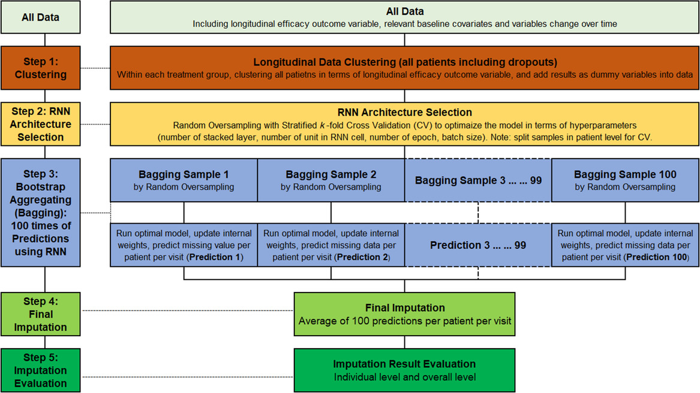

# Introduction

Missing data is a common problem among statistical analyses. Data can be missing due to a variety of reasons, form a subject not answering a question, to a subject leaving a study for one reason or another. Sometimes missing data is numerous and other times a study can have no missing data. Often times when a study has plentiful missing values classical statistical methods using the complete cases will be biased and something is needed to be done. 

In causal inference the issue of missing data is no different, there can be unintended bias introduced based on values that are missing. Causal inference methods might have more or less bias introduced by missing data due to the fact that we are trying to estimate counter factual outcomes, outcomes that don't exist in the first place. These estimates for the counter factual outcomes are based on the data observed in the study and if values are missing, information about the counter factuals is also being lost. Because of this I aim to investigate how causal inference estimates differ when there is missing data.


## Missingness in Data

It is important to understand the different types of missing data that can emerge in studies. Missing data can be classified into three main types: Missing Completely at Random (MCAR), Missing at Random (MAR), and Missing Not at Random (MNAR), each with distinct implications for analysis @little_statistical_2019. MCAR occurs when the missingness is entirely unrelated to both observed and unobserved data, meaning the data is missing purely by chance. In this case, traditional statistical techniques like complete case analysis remain valid, as the missing data introduces minimal bias. MAR arises when the probability of missing data is related to observed data but not to the missing values themselves. While this scenario introduces bias, it can often be addressed through techniques like multiple imputation that account for the relationship between observed variables and missingness. MNAR, on the other hand, is the most challenging type of missing data, where the missingness is directly related to the unobserved data. For example, patients may drop out of a study because their condition worsens. MNAR often introduces significant bias that cannot be addressed using standard techniques without strong assumptions. Specialized methods, such as machine learning-based imputation, are typically required to mitigate the impact of MNAR data.

# Methods

This study looks into the differences in the estimated treatment effect for compete case analysis in MNAR data compared to the imputed data estimated treatment effects. The following subsections go into detail about the methods of data imputation and causal inference to estimate the treatment effect.

## Data Imputation

Using Machine Learning techniques @haliduola_missing_2022 are able to impute MNAR data from a clinical trial for anxiety medication. The first step of the imputation was to cluster the data by tox response. This response curve is used to group better understand the differences between subjects based on their initial and continued response to the drug. Due to the time component of the data a recursive neural network was utilized in the data imputation. In addition due to the small sample size of some cluster over sampling was used in the training dataset. Because of this method, the data that are MNAR can be imputed with minimal loss of information and induced bias.

{width=60%}

## Causal Inference Methods

Two causal inference methods will be used to estimate the treatment effect of the anxiety drug from the baseline checkup to the final checkup. The two methods that will be tested are difference in difference (Diff-in-Diff) and IP-weighting. Both methods estimate the average treatment effect over time assusing that the assumptions hold. 


# Analysis 

## Exploratory Data Analysis

The response variable is based on the Hamilton Anxiety Rating Scale (HAMA), therefore a lower score represents a better response. These scores where observed at a baseline at week 0 and then after treatment at week 1, 2, 4, and 6. Below in figure 2 we can see the scores of each subject at each checkup, untreated is on the left and treated subjects are on the right. The observations shown as a red "X" are ones that contain missing score values. There are 80 missing scores in the dataset.

\begin{figure}

{\centering \includegraphics{missingness_in_causal_inference_files/figure-latex/unnamed-chunk-1-1} 

}

\caption{Observed responses by Week}\label{fig:unnamed-chunk-1}
\end{figure}

In the following tables we can see how these missing scores are distributed. We can see in table 1 the split of the missing values between treated and untreated. The split is fairly even with 38 missing scores in the treatment group and 42 missing scores in the untreated group. We can see that there is slightly more missing values in the untreated group. Looking in table 2 the missing values incease as time goes on in the study. This is possibly due to the drug potentially not working or even the oposite. This time related missingness is a sign that there can be a reason the data are missing and a pattern that could be causing the missing.


```{=latex}
\global\setlength{\Oldarrayrulewidth}{\arrayrulewidth}

\global\setlength{\Oldtabcolsep}{\tabcolsep}

\setlength{\tabcolsep}{2pt}

\renewcommand*{\arraystretch}{1.5}


\providecommand{\ascline}[3]{\noalign{\global\arrayrulewidth #1}\arrayrulecolor[HTML]{#2}\cline{#3}}

\begin{longtable}[c]{|p{0.75in}|p{0.75in}}


\ascline{1.5pt}{666666}{1-2}

\multicolumn{1}{>{\raggedleft}m{\dimexpr 0.75in+0\tabcolsep}}{\textcolor[HTML]{000000}{\fontsize{11}{11}\selectfont{Treatment}}} & \multicolumn{1}{>{\raggedleft}m{\dimexpr 0.75in+0\tabcolsep}}{\textcolor[HTML]{000000}{\fontsize{11}{11}\selectfont{NA\ count}}} \\

\ascline{1.5pt}{666666}{1-2}\endfirsthead 

\ascline{1.5pt}{666666}{1-2}

\multicolumn{1}{>{\raggedleft}m{\dimexpr 0.75in+0\tabcolsep}}{\textcolor[HTML]{000000}{\fontsize{11}{11}\selectfont{Treatment}}} & \multicolumn{1}{>{\raggedleft}m{\dimexpr 0.75in+0\tabcolsep}}{\textcolor[HTML]{000000}{\fontsize{11}{11}\selectfont{NA\ count}}} \\

\ascline{1.5pt}{666666}{1-2}\endhead


\multicolumn{1}{>{\raggedleft}m{\dimexpr 0.75in+0\tabcolsep}}{\textcolor[HTML]{000000}{\fontsize{11}{11}\selectfont{1}}} & \multicolumn{1}{>{\raggedleft}m{\dimexpr 0.75in+0\tabcolsep}}{\textcolor[HTML]{000000}{\fontsize{11}{11}\selectfont{38}}} \\


\multicolumn{1}{>{\raggedleft}m{\dimexpr 0.75in+0\tabcolsep}}{\textcolor[HTML]{000000}{\fontsize{11}{11}\selectfont{0}}} & \multicolumn{1}{>{\raggedleft}m{\dimexpr 0.75in+0\tabcolsep}}{\textcolor[HTML]{000000}{\fontsize{11}{11}\selectfont{42}}} \\

\ascline{1.5pt}{666666}{1-2}


\end{longtable}


\arrayrulecolor[HTML]{000000}

\global\setlength{\arrayrulewidth}{\Oldarrayrulewidth}

\global\setlength{\tabcolsep}{\Oldtabcolsep}

\renewcommand*{\arraystretch}{1}
```


```{=latex}
\global\setlength{\Oldarrayrulewidth}{\arrayrulewidth}

\global\setlength{\Oldtabcolsep}{\tabcolsep}

\setlength{\tabcolsep}{2pt}

\renewcommand*{\arraystretch}{1.5}


\providecommand{\ascline}[3]{\noalign{\global\arrayrulewidth #1}\arrayrulecolor[HTML]{#2}\cline{#3}}

\begin{longtable}[c]{|p{0.75in}|p{0.75in}}


\ascline{1.5pt}{666666}{1-2}

\multicolumn{1}{>{\raggedleft}m{\dimexpr 0.75in+0\tabcolsep}}{\textcolor[HTML]{000000}{\fontsize{11}{11}\selectfont{Week}}} & \multicolumn{1}{>{\raggedleft}m{\dimexpr 0.75in+0\tabcolsep}}{\textcolor[HTML]{000000}{\fontsize{11}{11}\selectfont{NA\ count}}} \\

\ascline{1.5pt}{666666}{1-2}\endfirsthead 

\ascline{1.5pt}{666666}{1-2}

\multicolumn{1}{>{\raggedleft}m{\dimexpr 0.75in+0\tabcolsep}}{\textcolor[HTML]{000000}{\fontsize{11}{11}\selectfont{Week}}} & \multicolumn{1}{>{\raggedleft}m{\dimexpr 0.75in+0\tabcolsep}}{\textcolor[HTML]{000000}{\fontsize{11}{11}\selectfont{NA\ count}}} \\

\ascline{1.5pt}{666666}{1-2}\endhead


\multicolumn{1}{>{\raggedleft}m{\dimexpr 0.75in+0\tabcolsep}}{\textcolor[HTML]{000000}{\fontsize{11}{11}\selectfont{0}}} & \multicolumn{1}{>{\raggedleft}m{\dimexpr 0.75in+0\tabcolsep}}{\textcolor[HTML]{000000}{\fontsize{11}{11}\selectfont{0}}} \\


\multicolumn{1}{>{\raggedleft}m{\dimexpr 0.75in+0\tabcolsep}}{\textcolor[HTML]{000000}{\fontsize{11}{11}\selectfont{1}}} & \multicolumn{1}{>{\raggedleft}m{\dimexpr 0.75in+0\tabcolsep}}{\textcolor[HTML]{000000}{\fontsize{11}{11}\selectfont{0}}} \\


\multicolumn{1}{>{\raggedleft}m{\dimexpr 0.75in+0\tabcolsep}}{\textcolor[HTML]{000000}{\fontsize{11}{11}\selectfont{2}}} & \multicolumn{1}{>{\raggedleft}m{\dimexpr 0.75in+0\tabcolsep}}{\textcolor[HTML]{000000}{\fontsize{11}{11}\selectfont{14}}} \\


\multicolumn{1}{>{\raggedleft}m{\dimexpr 0.75in+0\tabcolsep}}{\textcolor[HTML]{000000}{\fontsize{11}{11}\selectfont{4}}} & \multicolumn{1}{>{\raggedleft}m{\dimexpr 0.75in+0\tabcolsep}}{\textcolor[HTML]{000000}{\fontsize{11}{11}\selectfont{23}}} \\


\multicolumn{1}{>{\raggedleft}m{\dimexpr 0.75in+0\tabcolsep}}{\textcolor[HTML]{000000}{\fontsize{11}{11}\selectfont{6}}} & \multicolumn{1}{>{\raggedleft}m{\dimexpr 0.75in+0\tabcolsep}}{\textcolor[HTML]{000000}{\fontsize{11}{11}\selectfont{43}}} \\

\ascline{1.5pt}{666666}{1-2}


\end{longtable}


\arrayrulecolor[HTML]{000000}

\global\setlength{\arrayrulewidth}{\Oldarrayrulewidth}

\global\setlength{\tabcolsep}{\Oldtabcolsep}

\renewcommand*{\arraystretch}{1}
```


## Complete Case analysis

Using the complete cases in the dataset 80 observations are lost due to missing response values. Using complete case analysis will most likely result in biased estimated due to the previously mentioned MNAR nature of the data. The goal of causal inerence is to estiamte the average treatement effect and doing so often includes estimating counterfactual outcomes. The estimated values of the counterfactual outcome may be biased by the missing information in the missing data. More sophisticated causal inference methods account for the fact that the counterfactuals are missing themeselves and may have less bias estimates.

The first method used is Diff-in-Diff, this method relies on the assumptions that the treatment and control are similar with parallel trends in the outcome. In figure 3 the trend lines for the complete case analysis can be seen. Most importantly we can see that the trend lines from baseline to week 1 are parallel, if there is some period before the drug takes effect this provides evidence that the parallel trends assumption is correct. Additionally Knowing that the data comes from a clinical trial we can say that the the treatment and control were most likely well randomized.

\newpage
\begin{figure}

{\centering \includegraphics{missingness_in_causal_inference_files/figure-latex/unnamed-chunk-4-1} 

}

\caption{Treatment and Controll Trend Lines by Week}\label{fig:unnamed-chunk-4}
\end{figure}

Fitting the Diff-in-Diff model the results are shownin table __

\begin{table}[!t]
\fontsize{12.0pt}{14.4pt}\selectfont
\begin{tabular*}{\linewidth}{@{\extracolsep{\fill}}lccc}
\toprule
\textbf{Characteristic} & \textbf{Beta} & \textbf{95\% CI}\textsuperscript{\textit{1}} & \textbf{p-value} \\ 
\midrule\addlinespace[2.5pt]
treat & 1.6 & -0.69, 3.9 & 0.2 \\ 
week & -0.86 & -1.2, -0.48 & <0.001 \\ 
DID & -0.51 & -1.1, 0.03 & 0.063 \\ 
\bottomrule
\end{tabular*}
\begin{minipage}{\linewidth}
\textsuperscript{\textit{1}}CI = Confidence Interval\\
\end{minipage}
\end{table}


## Imputed Values analysis


# Conclusion and Discussion


\newpage
# References

<div id="refs"></div>
